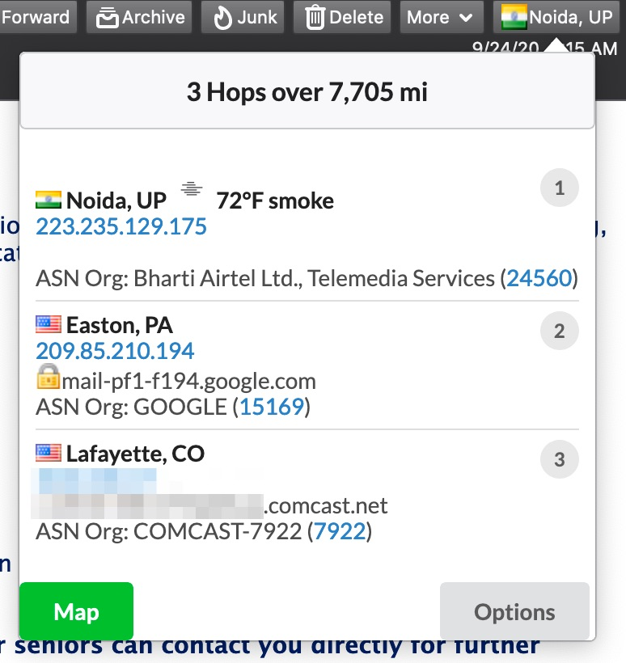
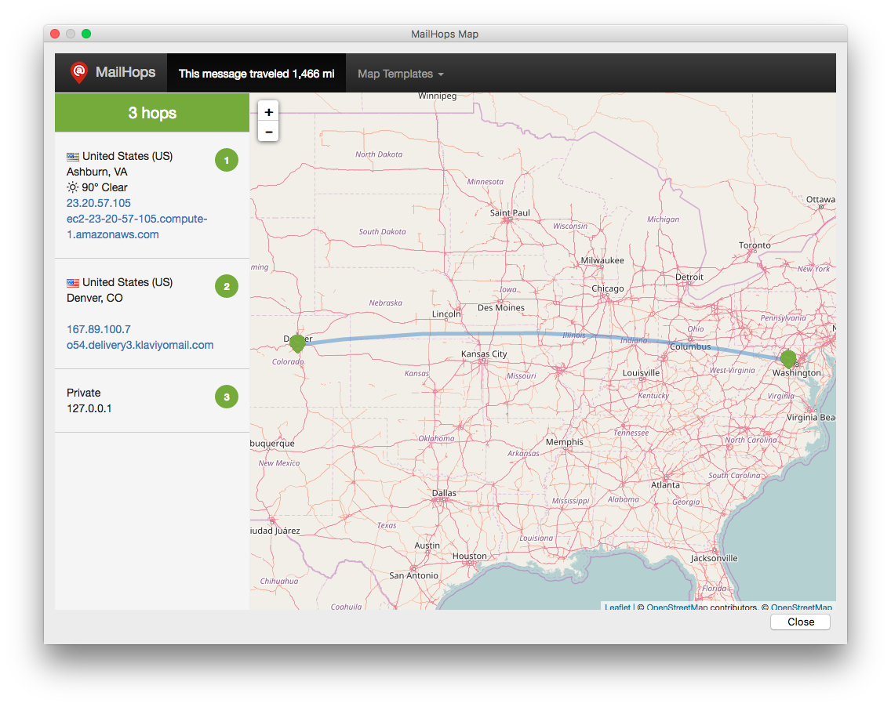
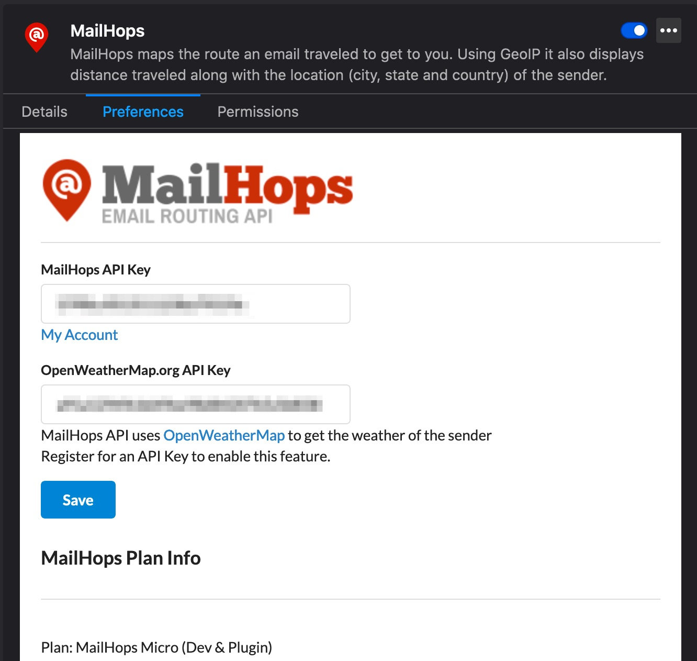

# MailHops Thunderbird Plugin
[www.MailHops.com](https://www.mailhops.com)


MailHops is an email route API. It does a few things:

1. Returns the route an email took based on the Received header IP addresses
1. Shows you a map an email took based on the Received header IP addresses
1. Shows the weather of the sender when you provide a [OpenWeatherMap](https://openweathermap.org/api) API key.
1. Will tag and mark messages as Junk if the travel time is too long.
1. Performs DNSBL check on messages.
1. Shows DKIM and SPF Authentication results.

### MailHops Message View



### MailHops Route Map



### MailHops Options



### MailHops Dashboard


### Editing the code
1. After you make changes you can run the [build.sh](build.sh) script
1. Open Postbox or Thunderbird and goto Tools->Add-ons and "Install Add-on From File..."
1. Choose mailhops.xpi from build script

```sh
$ chmod +x build.sh
$ ./build.sh
```

### MailHops API
- [https://github.com/mailhops](https://github.com/mailhops)

### Download
- [Download this plugin from Mozilla](https://addons.mozilla.org/en-US/thunderbird/addon/mailhops/)
